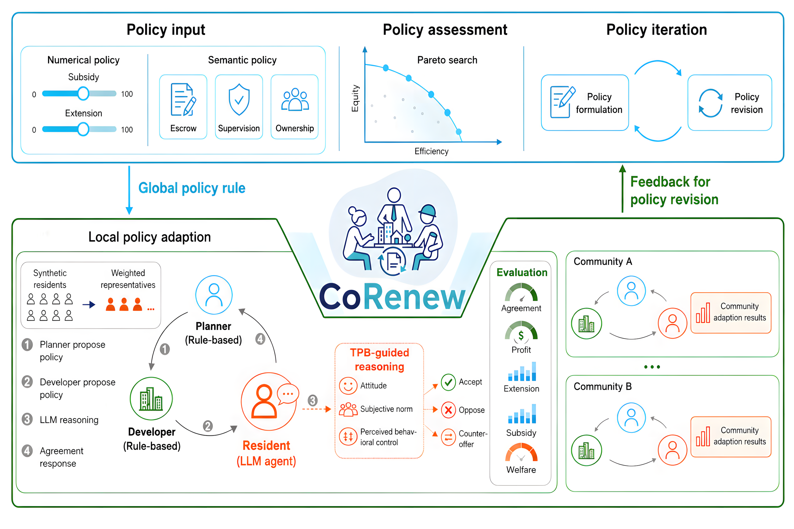
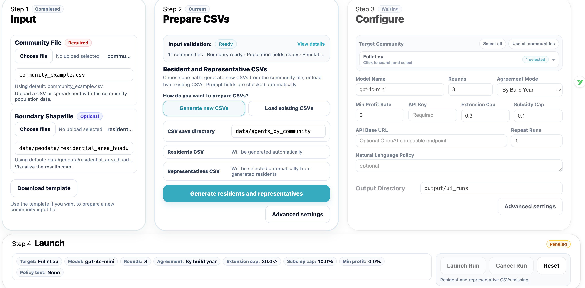

# CoRenew

CoRenew is a local web platform for simulating and analyzing multifamily residential redevelopment negotiations. It models repeated interactions among a public planner, a developer, and resident representatives, and it helps users prepare agent CSVs, run policy simulations, inspect community-level results, and compare policy rules.

This document is the consolidated operation manual for the current CoRenew web framework. If older notes or README sections describe a different workflow, follow this manual.

The code framework is inspired by [Miracle1207/EconGym](https://github.com/Miracle1207/EconGym) and [S-Abdelnabi/LLM-Deliberation](https://github.com/S-Abdelnabi/LLM-Deliberation).



---

## Contents

1. [What CoRenew Does](#1-what-corenew-does)
2. [Agent Framework Setup](#2-agent-framework-setup)
3. [Quick Start](#3-quick-start)
4. [Current Web Workflow](#4-current-web-workflow)
5. [LLM API configuration](#5-llm-api-configuration)
6. [Input Preparation](#6-input-preparation)
7. [Upload & Run Workflow](#7-upload--run-workflow)
8. [Simulation Outputs](#8-simulation-outputs)
9. [Project Structure and Core Components](#9-project-structure-and-core-components)

---

## 1. What CoRenew Does

Urban redevelopment requires collective agreement under competing incentives. Residents care about relocation burden, housing improvement, extension area, parking, compensation, public services, and affordability. Developers care about construction costs, saleable area, parking revenue, public-service obligations, and minimum profit constraints. Planners adjust policy levers to reach agreement thresholds while keeping projects viable.

CoRenew turns this negotiation problem into an executable multi-agent simulation:

1. The planner proposes policy settings, such as extension caps and subsidy caps.
2. The developer proposes prices, parking fees, public-service construction decisions, and other project terms.
3. Resident representatives evaluate the proposal and decide whether to agree.
4. The environment computes agreement rate, resident utility, developer profit, policy feasibility, and terminal status.
5. The system writes structured results for replay, mapping, and policy comparison.

The framework supports both rule-based and LLM-based agents. The recommended workflow is through the local web interface.

---

## 2. Agent Framework Setup

CoRenew defines three agent types: residents, developer, and planner. Each agent receives a public observation shared across the negotiation environment and a private observation specific to its role. Agents then produce public actions visible to the negotiation process and, where applicable, private internal values used to form those actions.

| Agent type | Public observation | Private observation | Public action | Private action |
|---|---|---|---|---|
| Resident | agreement ratio;<br>approval threshold;<br>rounds left;<br>policy limits | cost and utility;<br>housing condition | support or oppose;<br>quoted base price;<br>quoted extension price;<br>stated parking decision;<br>quoted extension area | reservation base price;<br>reservation extension price;<br>parking willingness to pay;<br>desired extension area |
| Developer | same as residents | project cost and revenue;<br>minimum profit requirement | set base price;<br>set extension price;<br>set parking price | --- |
| Planner | same as residents | subsidy capacity;<br>extension constraints;<br>recent offer change | adjust subsidy;<br>adjust extension ratio;<br>choose policy package | --- |

---

## 3. Quick Start

A Conda environment is recommended because CoRenew uses geospatial packages such as GeoPandas and Shapely:

```bash
cd CoRenew
conda env create -f environment.yml
conda activate corenew-local
```

If you prefer `pip`:

```bash
cd CoRenew
python -m venv .venv
source .venv/bin/activate
pip install -r requirements.txt
```

On Windows:

```bat
cd CoRenew
python -m venv .venv
.venv\Scripts\activate
pip install -r requirements.txt
```

From the project root:

```bash
cd CoRenew
bash run_local.sh
```

Then open:

```text
http://127.0.0.1:7860/run/setup
```

You can also start the app directly:

```bash
python ui_app.py --home-path /run/setup
```
---

## 4. Current Web Workflow

The current web interface has three top-level pages:

```text
Upload & Run
Experiment Results Analysis
Policy Comparison
```

### Upload & Run


This is the main operation page, organized into four cards:

1. **Step 1: Upload inputs**  
   Provide the community CSV and boundary file. Use `community_csv_template.xlsx` as the required CSV format reference.

2. **Step 2: Prepare agents**  
   Generate or load the Residents CSV and Representatives CSV.

3. **Step 3: Configure run settings**  
   Select target communities, model settings, policy caps, and the output directory.

4. **Step 4: Run simulations**  
   Launch simulations and write outputs.

### Experiment Results Analysis


This page visualizes community-level experiment results on a map. By default, it reads result files from `output/ui_runs`. If you want to analyze a newly generated experiment, update the **Experiment Result Directory** to match the result root specified in **Step 3** on the **Upload & Run** page. The page joins community-level outcomes with the uploaded boundary shapefile.

The visualization unit is **one community under one policy rule**. If repeated runs exist for the same community and policy rule, their results are averaged before visualization.

Each community on the map can be clicked to inspect detailed negotiation information.


### Policy Comparison


This page compares policy rules across selected communities. By default, it reads result files from `output/ui_runs`. If you want to compare results from a newly generated experiment, update the **Experiment Result Directory** to match the result root specified in **Step 3** on the **Upload & Run** page.

The comparison unit is:

```text
one policy rule averaged across all selected communities
```

Each point in the Pareto trade-off scatter represents one policy rule. It is not a raw run and not a single community. The multi-objective ranking and heatmap are also computed from the same rule-level averages.

## 5. LLM API configuration

CoRenew uses an OpenAI-compatible Chat Completions interface for LLM-based agents. Before running simulations with LLM agents, users need to provide three items:

- **API key**
- **API base URL**
- **Model name**

The recommended way is to configure them directly in the web interface:

```text
Upload & Run
→ Step 3 Configure
→ Model Name
→ API Key
→ API Base URL
```

This setup allows users to run CoRenew with the official OpenAI API, an integrated LLM platform, a model gateway, or a private deployment, as long as the service exposes an OpenAI-compatible API endpoint.
The repository does not hard-code a provider endpoint; set `OPENAI_BASE_URL` or `LLM_BASE_URL`, or enter the API base URL in the local web interface when launching a run.

For example, when using an integrated platform, the fields may be filled as:

```text
Model Name: your-model-name
API Key: your-platform-api-key
API Base URL: https://your-platform-endpoint/v1
```

The same values can also be configured through environment variables:

```bash
export OPENAI_API_KEY="your-api-key"
export OPENAI_BASE_URL="https://your-api-endpoint/v1"
export OPENAI_MODEL="your-model-name"
```

Alternatively, users can create a local `.env.local` file under the CoRenew project directory:

```bash
OPENAI_API_KEY=your-api-key
OPENAI_BASE_URL=https://your-api-endpoint/v1
OPENAI_MODEL=your-model-name
```

## 6. Input Preparation

The local bundle includes sample input files for demonstration. The bundled
example dataset covers 11 residential communities in Huadu District,
Guangzhou, Guangdong Province, China.

The demo inputs are provided at these paths relative to the CoRenew project directory:

| Input | Path |
|---|---|
| Community attributes | `community_example.csv` |
| Resident agents and resident representatives | `data/agents_by_community/` |
| Official planner and developer agents | `data/agents_official/` |
| Example community boundary geodata | `data/geodata/residential_area_huadu.shp` |

The current default input structure is:

```text
CoRenew/
├── community_example.csv
├── data/
│   ├── agents_by_community/
│   │   ├── ALL_agents.csv
│   │   └── community_representatives_list.csv
│   ├── agents_official/
│   │   └── official_agents.csv
│   └── geodata/
│       └── residential_area_huadu.*
└── output/
    └── ui_runs/
```

### 6.1 Community file

The community file is the starting point for Step 1. The default file is:

```text
community_example.csv
```

The bundled example dataset provides community attributes and boundary geodata for the 11 demo communities. It is intended as trial-run data for installing, launching, and exploring the local workflow.

It should contain one row per community. Required or strongly recommended information includes:

| Information | Purpose |
|---|---|
| Community name | Used to match residents, representatives, shapefile boundaries, and results |
| Building area / land area | Used for redevelopment accounting |
| FAR or floor-area information | Used for extension and construction logic |
| Build year | Used by building-year-based agreement rules |
| Household count | Used to generate residents |
| Market price / nearby price | Used for developer and resident calculations |
| Parking information | Used for parking demand and fee logic |

Column names can vary, but the UI validation step must be able to identify the required fields.

### 6.2 Boundary shapefile

The boundary file is optional for running simulations, but required for reliable map visualization. The default boundary is:

```text
data/geodata/residential_area_huadu.shp
```

The bundled boundary file has been reduced to the 11 demo communities and keeps only the matching field required by the UI (`community`) plus geometry. Uploaded boundaries may use any supported community-name field, such as `community`.

### 6.3 Residents CSV and Representatives CSV

CoRenew uses two resident-related CSV files:

```text
Residents CSV
Representatives CSV
```

They are different files and serve different roles.

| File | Default path | Meaning |
|---|---|---|
| Residents CSV | `data/agents_by_community/ALL_agents.csv` | Full synthetic resident population used for weighted accounting |
| Representatives CSV | `data/agents_by_community/community_representatives_list.csv` | Smaller set of representative agents used in negotiation |

The web UI can either generate both files or load existing files.

### 6.4 Official agents file

The official planner and developer agents are loaded from:

```text
data/agents_official/official_agents.csv
```

Most users do not need to edit this file.

---

## 7. Upload & Run Workflow

### 7.1 Step 1: Input

Step 1 handles the community input and optional boundary shapefile.

The user can:

1. Use the bundled default `community_example.csv`.
2. Upload a new community CSV or spreadsheet.
3. Use the bundled default boundary shapefile.
4. Upload a new shapefile bundle.
5. Download an input template.

The file upload controls use English labels such as `Choose file`, `Choose files`, and `No upload selected`.

Step 1 is complete when the community file can be read and the required community fields are available.

### 7.2 Step 2: Generate synthetic residents

Step 2 prepares the two resident-agent CSVs required by the simulator:

```text
Residents CSV
Representatives CSV
```

The top of Step 2 shows a compact input-validation bar, for example:

```text
Input validation: Ready
11 communities · Boundary ready · Population fields ready · Simulation fields ready
```

Detailed validation information is available through `View details`. The detailed view may show:

```text
Community file: Default
Boundary file: Ready
Population fields: Ready
Simulation fields: Ready
Using default community file
```

Step 2 has two modes.

#### Mode A: Generate new agents

Use this mode when you have a community file and want CoRenew to create residents and representatives for you.

Default save directory:

```text
data/agents_by_community
```

The main action is:

```text
Generate residents and representatives
```

This single action performs the full workflow:

1. Generate the full Residents CSV.
2. Select representatives from generated residents.
3. Save both CSV files.
4. Automatically check prompt fields.

Generated files are saved as:

```text
data/agents_by_community/ALL_agents.csv
data/agents_by_community/community_representatives_list.csv
```

#### Mode B: Load existing agents

Use this mode when the two CSVs already exist.

The UI shows only the two path fields required for loading:

```text
Residents CSV
Representatives CSV
```

The main action is:

```text
Load CSVs
```

After loading, the system validates the two CSV files and automatically checks prompt fields.

#### Prompt field behavior

Prompt fields are checked automatically. There is no manual `Generate Prompt Fields` button in the current UI.

Automatic checks run after:

1. Generating residents and representatives.
2. Loading existing CSVs.
3. Updating relevant CSV paths or field settings.

If prompt fields are valid, the UI reports that they are ready. If required fields are missing, the UI should show a clear message such as:

```text
Prompt fields: Missing fields: age, income, community_id
```

#### Advanced settings in Step 2

Advanced settings provide optional controls for CSV generation and manual debugging. The generation parameters are used by the main `Generate residents and representatives` button, so users can tune resident-agent synthesis to better match local community conditions before launching simulations.

Common generation parameters include:

| Parameter | Meaning |
|---|---|
| Residents per Household | Average number of resident agents created for each household. Adjust this to match local household-size statistics. |
| Representatives per Community | Number of representative agents selected for each community negotiation. |
| Vacant Unit Ratio | Share of units treated as vacant during resident generation. Adjust this when local vacancy conditions differ from the default assumption. |
| Hardship Quantile | Threshold used to label hardship-sensitive residents. Lower or higher values change how many residents are modeled as more vulnerable to renewal costs. |

These parameters should be configured when the default synthetic population does not reflect local demographics, vacancy patterns, or affordability pressure. After changing them, rerun `Generate residents and representatives` so both the Residents CSV and Representatives CSV are regenerated from the updated assumptions.

Debug actions are still available for rerunning one CSV sub-step manually when needed. Examples include:

```text
Generate residents only
Re-select representatives
Save CSVs manually
Inspect validation details
```

### 7.3 Step 3: Configure

Step 3 sets simulation parameters.

Main fields include:

| Field | Meaning |
|---|---|
| Target Community | One or more communities to simulate |
| Model Name | LLM model name, for example `DeepSeek-V3.2` |
| Rounds | Maximum negotiation rounds |
| Agreement Mode | Agreement threshold logic, such as building-year-based rules |
| Min Profit Rate | Developer minimum acceptable profit rate |
| API Key | Runtime API key |
| API Base URL | OpenAI-compatible endpoint |
| Extension Cap | Maximum allowed extension ratio |
| Subsidy Cap | Maximum allowed subsidy ratio |
| Natural Language Policy | Optional soft policy text shown to agents |
| Output Directory | Where run outputs are saved |

Default output directory:

```text
output/ui_runs
```


#### Advanced settings in Step 3

Step 3 also provides advanced policy and utility settings. These controls are optional, but they are useful when users need to test local agreement rules or customize how each agent type evaluates costs and benefits.

| Advanced setting | Meaning |
|---|---|
| Agreement by build year | Configures the agreement-ratio gradient used when `Agreement Mode` is `By Build Year`. Each row maps a building-age upper bound (`max_age`) to a required agreement ratio (`ratio`). For example, newer buildings may require a higher agreement ratio, while older buildings may use a lower threshold. A blank `max_age` row can be used as the fallback ratio for buildings above the listed age ranges. |
| Utility Setting | Configures the cost-benefit composition for planner, developer, and resident agents. Utility fields can be read from columns in the uploaded community CSV, assigned fixed values, or added as custom fields when the default schema does not include a local factor. |

Use `Utility Setting` when local renewal decisions depend on additional cost, revenue, subsidy, compensation, parking, extension, or public-service factors that are not fully captured by the default fields. Users can review active utility categories, modify the fields in each category, and add custom utility fields before launching the simulation.

### 7.4 Step 4: Launch

Step 4 launches the configured simulations.

Before launching, check that:

1. Step 1 input validation is ready.
2. Step 2 has generated or loaded the Residents CSV and Representatives CSV.
3. Step 3 has a valid target community, model, API settings, policy caps, and output directory.

When the simulation is launched, CoRenew creates a run configuration, executes the negotiation loop, and writes structured outputs to the configured output directory.

A typical launch produces:

```text
output/ui_runs/
├── ui_run.yaml
├── run_log.txt
├── summary.json
├── summary.csv
└── sim_<community>/
    ├── negotiation_log_<timestamp>.json
    └── round_checkpoint.json
```

After launch, inspect the generated links and then open:

```text
Experiment Results Analysis
Policy Comparison
```

---

## 8. Simulation Outputs

Simulation outputs are written under the configured `Output Directory`, usually:

```text
output/ui_runs
```

A standard single-run output folder contains:

| File or folder | Purpose |
|---|---|
| `ui_run.yaml` | Runtime configuration used for the simulation |
| `run_log.txt` | Plain-text execution log |
| `summary.json` | Structured run summary |
| `summary.csv` | Tabular run summary |
| `sim_<community>/negotiation_log_<timestamp>.json` | Detailed per-community negotiation log |
| `sim_<community>/round_checkpoint.json` | Checkpoint state for continuation or debugging |

The negotiation log stores:

1. Community information.
2. Success or failure status.
3. Termination reason.
4. Final agreement rate.
5. Developer profit and profit rate.
6. Final planner and developer policies.
7. Per-round planner, developer, and resident decisions.

For reliable cross-run analysis, the recommended primary result file is:

```text
output/ui_runs/phase2_community_results_by_rule.csv
```

---

## 9. Project Structure and Core Components

### 9.1 Project structure

```text
CoRenew/
├── README.md
├── graph_abstract.png
├── requirements.txt
├── environment.yml
├── run_local.sh
├── run_local.bat
├── ui_app.py
├── main.py
├── runner.py
├── cfg/
│   └── rule-based/
├── data/
│   ├── agents_by_community/
│   ├── agents_official/
│   └── geodata/
├── agents/
│   ├── llm/
│   └── rule_based/
├── entities/
├── environment/
├── ui_modules/
└── utils/
```

### 9.2 Core components

| Component | Purpose |
|---|---|
| `ui_app.py` | Starts the local web application |
| `ui_modules/` | Web pages, controllers, result visualization, and local APIs |
| `environment/urban_renew_env.py` | Simulation state, action validation, transitions, rewards, and terminal conditions |
| `runner.py` | Coordinates negotiation rounds and writes logs/checkpoints |
| `entities/` | Planner, developer, and resident entity definitions |
| `agents/rule_based/` | Rule-based planner and developer policies |
| `agents/llm/` | LLM wrappers and prompts |
| `cfg/` | Simulation configuration files |
| `data/` | Input agents and geodata |
| `output/` | Generated simulation outputs |
