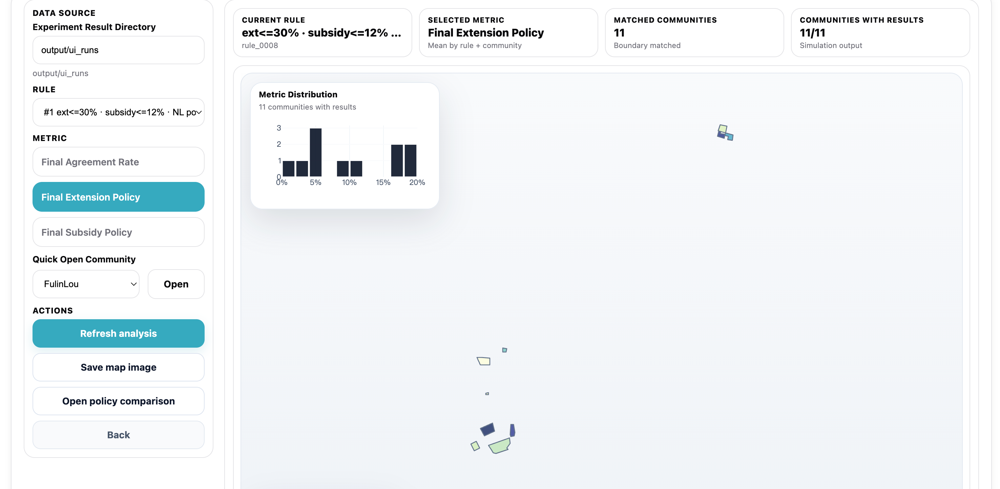
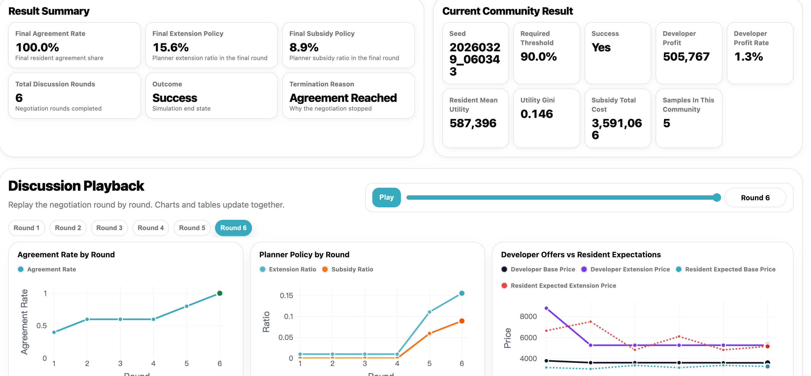
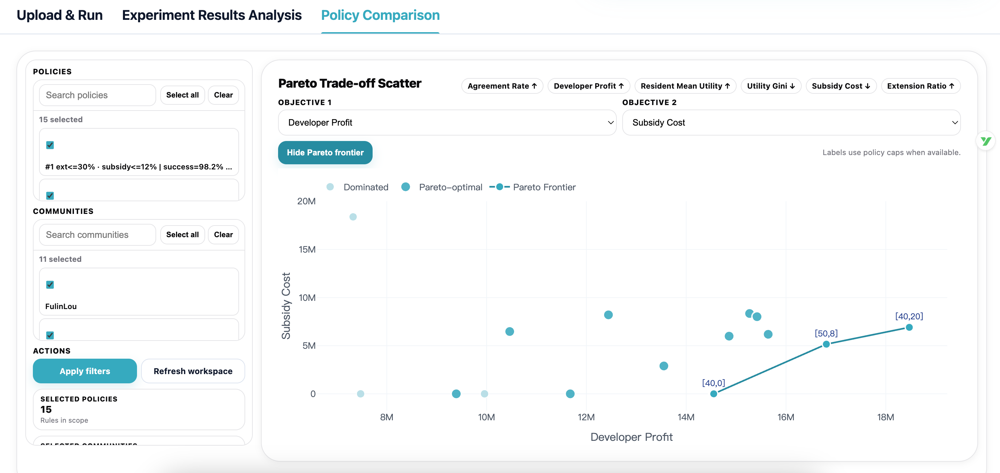

### Experiment Results Analysis



This page visualizes community-level experiment results on a map. By default, it reads result files from `output/ui_runs`. If you want to analyze a newly generated experiment, update the **Experiment Result Directory** to match the result root specified in **Step 3** on the **Upload & Run** page. The page joins community-level outcomes with the uploaded boundary shapefile.

The visualization unit is **one community under one policy rule**. If repeated runs exist for the same community and policy rule, their results are averaged before visualization.

Each community on the map can be clicked to inspect detailed negotiation information.



### Policy Comparison



This page compares policy rules across selected communities. By default, it reads result files from `output/ui_runs`. If you want to compare results from a newly generated experiment, update the **Experiment Result Directory** to match the result root specified in **Step 3** on the **Upload & Run** page.

The comparison unit is:

```text
one policy rule averaged across all selected communities
```

Each point in the Pareto trade-off scatter represents one policy rule. It is not a raw run and not a single community. The multi-objective ranking and heatmap are also computed from the same rule-level averages.
